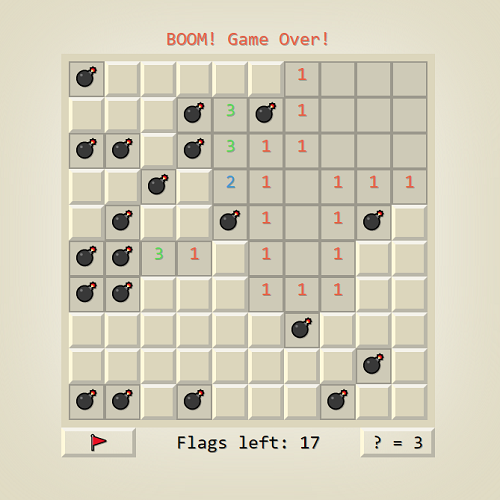

<h1 align="center">Minesweeper</h1>

Minesweeper is a single-player puzzle video game. The objective of the game is to clear a rectangular board containing hidden "mines" or bombs without detonating any of them, with help from clues about the number of neighboring mines in each field.

  
  &nbsp;
  

  <a href="https://faisalakhtar.github.io/minesweeper/">Play Game</a>
  ·
  <a href="https://github.com/faisalAkhtar/minesweeper/issues/new/choose">Report Bug</a>
  ·
  <a href="https://github.com/faisalAkhtar/minesweeper/issues/new/choose">Request Feature</a>

  
   
  Minesweeper

<h2 align="center">Built with :heart: and :sparkles:JavaScript:sparkles:</h2>